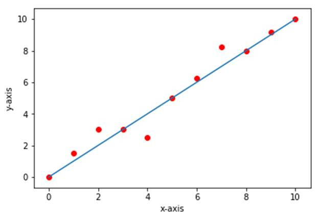

another one
Treansfer Learning technique is used to indentify tom and jerry.

<b>Linear Regression using Tensorflow Estimator</b>

<b>The Theory</b>

Linear Regression is the process of fitting a line to the
dataset.

&nbsp;

<b>Single
Variable Linear Regression</b>

&nbsp;

<b>The
Mathematics</b>

The equation of Line is

