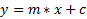
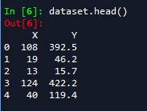
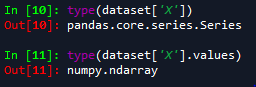
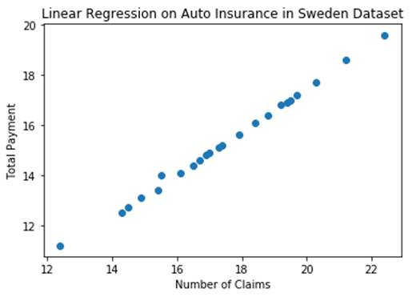
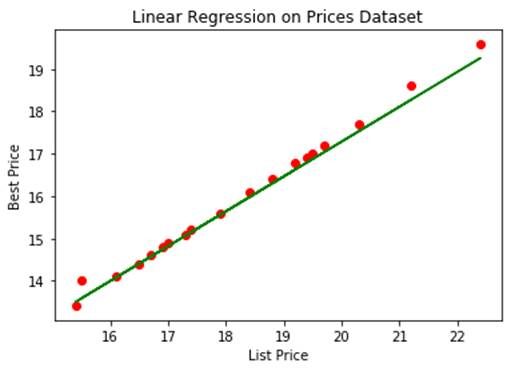

another one
Treansfer Learning technique is used to indentify tom and jerry.

<meta http-equiv=Content-Type content="text/html; charset=windows-1252">
<meta name=Generator content="Microsoft Word 15 (filtered)">

<b>Linear Regression using Tensorflow Estimator</b>

<b>The Theory</b>

Linear Regression is the process of fitting a line to the
dataset.

&nbsp;

<b>Single
Variable Linear Regression</b>

&nbsp;

<b>The
Mathematics</b>

The equation of Line is

Where,

 y = dependent variable

 X = independent variable

C = intercept 

&nbsp;

The algorithm is trying to fit a line to the data by
adjusting the values of m and c. Its Objective is to attain to a value of m
such that for any given value of x it would be properly predicting the value of
y.

&nbsp;

There are various ways in which we can attain the values of
m and c 

<ol style='margin-top:0in' start=1 type=1>
 <li class=MsoNormal style='margin-bottom:0in;margin-bottom:.0001pt;line-height:
     115%;border:none'>Statistical approach</li>
 <li class=MsoNormal style='margin-bottom:0in;margin-bottom:.0001pt;line-height:
     115%;border:none'>Iterative approach</li>
</ol>

&nbsp;

Here we are using a scikit learn framework which internally
uses iterative approach to attain the linear regression 

&nbsp;

<b>The
Dataset</b> 

Dataset consists of two columns namely X and y

Where

&nbsp;

For List Price Vs. Best Price
for a New GMC Pickup dataset

X = List price (in $1000) for
a GMC pickup truck

Y = Best price (in $1000) for
a GMC pickup truck

The data is taken from <i>Consumer’s
Digest.</i>

<i>&nbsp;</i>

For Fire and Theft in Chicago 

X = fires per 100 housing units

Y = thefts per 1000 population within the same Zip code in
the Chicago metro area

The data is taken from U.S Commission of Civil Rights.

&nbsp;

For Auto Insurance in Sweden dataset

X = number of claims

Y = total payment for all the claims in thousands of Swedish
Kronor

The data is taken from Swedish Committee on Analysis of Risk
Premium in Motor Insurance.

&nbsp;

For Gray Kangaroos dataset

X = nasal length (mm ¥10)

Y = nasal width (mm ¥ 10) 
for a male gray kangaroo from a random sample of
such animals

The data is taken from Australian<i>
Journal of Zoology</i>, Vol. 28, p607-613.

&nbsp;

<u><a
href="http://college.cengage.com/mathematics/brase/understandable_statistics/7e/students/datasets/slr/frames/frame.html">Link to All Datasets</a></u>

<b>&nbsp;</b>

<b>The Code</b>

The Code was written in three
phases

<ol style='margin-top:0in' start=1 type=1>
 <li class=MsoNormalCxSpMiddle style='margin-bottom:0in;margin-bottom:.0001pt;
     text-align:justify;line-height:115%'>Data preprocessing phase</li>
 <li class=MsoNormalCxSpMiddle style='margin-bottom:0in;margin-bottom:.0001pt;
     text-align:justify;line-height:115%'>Training</li>
 <li class=MsoNormalCxSpMiddle style='margin-bottom:0in;margin-bottom:.0001pt;
     text-align:justify;line-height:115%'>Prediction and plotting</li>
</ol>

<b>&nbsp;</b>

<b>Data
Preprocessing Phase</b>

<b>Imports</b>

Numpy import for array processing, python doesn’t have built
in array support. The feature of working with native arrays can be used in
python with the help of numpy library.

Pandas is a library of python used for working with tables,
on importing the data, mostly data will be of table format, for ease
manipulation of tables pandas library is imported

Matplotlib is a library of python used to plot graphs, for
the purpose of visualizing the results we would be plotting the results with
the help of matplotlib library.

Tensorflow import since we are going to use tensorflow
framework for building model.

&nbsp;

<table class=a border=0 cellspacing=0 cellpadding=0 style='margin-left:5.0pt;
 border-collapse:collapse'>
 <tr>
  <td width=624 valign=top style='width:6.5in;background:#282A36;padding:5.0pt 5.0pt 5.0pt 5.0pt'>
  
# Imports 
  <b>import</b> numpy <b>as</b> np 
  <b>import</b> pandas <b>as</b> pd 
  <b>import</b>
  matplotlib.pyplot <b>as</b> plt 
  <b>import</b> tensorflow <b>as</b> tf

  </td>
 </tr>
</table>

&nbsp;

<b>Reading
the dataset from data</b>

In this line of code using the read_excel method of pandas
library, the dataset has been imported from data folder and stored in dataset
variable.

On visualizing the dataset, it contains of two columns X and
Y where X is dependent variable and Y is Independent Variable.

Note : On using Grey Kangaroos dataset,the data is
normalised, standardised,having a lot of inbuilt variance and outliers the code
would result in a gradient exploding problem.

<table class=a0 border=0 cellspacing=0 cellpadding=0 style='margin-left:5.0pt;
 border-collapse:collapse'>
 <tr>
  <td width=624 valign=top style='width:6.5in;background:#282A36;padding:5.0pt 5.0pt 5.0pt 5.0pt'>
  
# Reading the dataset from data 
  dataset = pd.read_csv(r'..\\data\\prices.csv')

  </td>
 </tr>
</table>

&nbsp;

On viewing the dataset, it
contains of two columns X and Y where X is dependent variable and Y is
Independent Variable.

<b>&nbsp;</b>

<b>Creating
Dependent and Independent variables</b>

The X Column from the dataset is extracted into an X
variable of type numpy, similarly the y variable

X is an independent variable 

Y is dependent variable Inference

<table class=a1 border=0 cellspacing=0 cellpadding=0 style='margin-left:5.0pt;
 border-collapse:collapse'>
 <tr>
  <td width=624 valign=top style='width:6.5in;background:#282A36;padding:5.0pt 5.0pt 5.0pt 5.0pt'>
  
# Creating Dependent and Independent variables 
  X = dataset['X'].values 
  y = dataset['Y'].values

  </td>
 </tr>
</table>

On input 10 it would result in a pandas Series object

So, values attribute is used to attain an numpy array

<b>Visualizing
the data </b>

The step is to just see how the dataset is 

On visualization the data would appear something like this

The X and Y attributes would vary based on dataset.

<table class=a2 border=0 cellspacing=0 cellpadding=0 style='margin-left:5.0pt;
 border-collapse:collapse'>
 <tr>
  <td width=624 valign=top style='width:6.5in;background:#282A36;padding:5.0pt 5.0pt 5.0pt 5.0pt'>
  
# Visualizing the data  
  title='Linear
  Regression on &lt;Dataset&gt;' 
  x_axis_label = 'X-value &lt; The corresponding attribute of X in dataset
  &gt;' 
  y_axis_label = 'y-value &lt; The corresponding attribute of X in dataset
  &gt;' 
  plt.scatter(X,y) 
  plt.title(title) 
  plt.xlabel(x_axis_label) 
  plt.ylabel(y_axis_label) 
  plt.show()

  </td>
 </tr>
</table>

&nbsp;

<b>Splitting
the data into training set and test set</b>

We are splitting the whole dataset into training and test
set where training set is used for fitting the line to data and test set is
used to check how good the line if for the data.

<table class=a3 border=0 cellspacing=0 cellpadding=0 style='margin-left:5.0pt;
 border-collapse:collapse'>
 <tr>
  <td width=624 valign=top style='width:6.5in;background:#282A36;padding:5.0pt 5.0pt 5.0pt 5.0pt'>
  
# Splitting the data into training set and test set 
  X_train,X_test = np.split(X,indices_or_sections = [int(len(X)*0.8)]) 
  y_train,y_test = np.split(y,indices_or_sections = [int(len(X)*0.8)])

  </td>
 </tr>
</table>

<b>&nbsp;</b>

<b>Training Phase</b>

<b>Variables for training </b>

&#9679;&nbsp;&nbsp;&nbsp;&nbsp;&nbsp;&nbsp;&nbsp;
Epochs: stands for how many time the
whole data is put through on forward propagation and one backward propagation.

&#9679;&nbsp;&nbsp;&nbsp;&nbsp;&nbsp;&nbsp;&nbsp;
Learning Rate: is a hyperparameter in
backpropagation algorithm to adjust the variables in graph based on loss obtained in forward propagation

&#9679;&nbsp;&nbsp;&nbsp;&nbsp;&nbsp;&nbsp;&nbsp;
&nbsp;

<table class=a4 border=0 cellspacing=0 cellpadding=0 style='margin-left:5.0pt;
 border-collapse:collapse'>
 <tr>
  <td width=624 valign=top style='width:6.5in;background:#282A36;padding:5.0pt 5.0pt 5.0pt 5.0pt'>
  
# Variables  
  epochs = 100 
  learning_rate = 0.001

  </td>
 </tr>
</table>

&nbsp;

<b>Feature Columns</b>

These are the features or
Independent variables used for training. We are transforming the numpy arrays
into tensorflow understandable feature columns specifying the column name as
key. This feature column would be fed into tensorflow estimators.

<table class=a5 border=0 cellspacing=0 cellpadding=0 style='margin-left:5.0pt;
 border-collapse:collapse'>
 <tr>
  <td width=624 valign=top style='width:6.5in;background:#282A36;padding:5.0pt 5.0pt 5.0pt 5.0pt'>
  
# Feature Columns 
  feature_columns = [tf.feature_column.numeric_column(key=&quot;X&quot;)]

  </td>
 </tr>
</table>

&nbsp;

<b>Creating feature dictionaries</b>

These dictionaries are used in
creating in the input function to model.train  and model.predict

&#9679;&nbsp;&nbsp;&nbsp;&nbsp;&nbsp;&nbsp;&nbsp;
features_train: used in input function
of model.train

&#9679;&nbsp;&nbsp;&nbsp;&nbsp;&nbsp;&nbsp;&nbsp;
features_test: used in input function
of model.predict

&nbsp;

<table class=a6 border=0 cellspacing=0 cellpadding=0 style='margin-left:5.0pt;
 border-collapse:collapse'>
 <tr>
  <td width=624 valign=top style='width:6.5in;background:#282A36;padding:5.0pt 5.0pt 5.0pt 5.0pt'>
  
# Creating feature dictionaries 
  features_train = {'X':X_train} 
  features_test  = {'X':X_test}

  </td>
 </tr>
</table>

&nbsp;

<b>&nbsp;</b>

<b>Creating an Input function which would return a batch dataset
on every call</b>

The input functions are written
for the tensorflow estimator function. The estimator would be expecting a batch
dataset of which would return a tuple of features and labels.

The type of processing expected
is 

&nbsp;

<table class=a7 border=0 cellspacing=0 cellpadding=0 style='margin-left:5.0pt;
 border-collapse:collapse'>
 <tr>
  <td width=624 valign=top style='width:6.5in;background:#282A36;padding:5.0pt 5.0pt 5.0pt 5.0pt'>
  
<b>def</b> <b>train_input_fn</b>(features,
  labels, batch_size): 
      &quot;&quot;&quot;An
  input function for training&quot;&quot;&quot; 
      #
  Convert the inputs to a Dataset. 
      dataset = tf.data.Dataset.from_tensor_slices((dict(features), labels)) 
      #
  Shuffle, repeat, and batch the examples. 
      <b>return</b> dataset.shuffle(1000).repeat().batch(batch_size)

  </td>
 </tr>
</table>

&nbsp;

It would return a batch
tf.data.Dataset Object

Another acceptable format of
input function is 

<table class=a8 border=0 cellspacing=0 cellpadding=0 style='margin-left:5.0pt;
 border-collapse:collapse'>
 <tr>
  <td width=624 valign=top style='width:6.5in;background:#282A36;padding:5.0pt 5.0pt 5.0pt 5.0pt'>
  
<b>def</b> <b>input_evaluation_set</b>(): 
      features = {'SepalLength': np.array([6.4, 5.0]), 
                  'SepalWidth':  np.array([2.8, 2.3]), 
                  'PetalLength': np.array([5.6, 3.3]), 
                  'PetalWidth':  np.array([2.2, 1.0])} 
      labels = np.array([2, 1]) 
      <b>return</b> features, labels

  </td>
 </tr>
</table>

&nbsp;

It would return a tuple of two
elements, first element features dict and second element labels

Other functions which would
support input format are numpy_input_fn and pandas_input_fn

For more docs and reference

&#9679;&nbsp;&nbsp;&nbsp;&nbsp;&nbsp;&nbsp;&nbsp;
<u><a
href="https://www.tensorflow.org/guide/premade_estimators">Tensorflow Premade Estimator Input Functions</a></u>

&#9679;&nbsp;&nbsp;&nbsp;&nbsp;&nbsp;&nbsp;&nbsp;
 <u><a
href="https://www.tensorflow.org/api_docs/python/tf/estimator/inputs">Estimator Inputs Module</a></u>

&nbsp;

<table class=a9 border=0 cellspacing=0 cellpadding=0 style='margin-left:5.0pt;
 border-collapse:collapse'>
 <tr>
  <td width=624 valign=top style='width:6.5in;background:#282A36;padding:5.0pt 5.0pt 5.0pt 5.0pt'>
  
# Creating an Input function which would return a batch dataset on
  every call 
  <b>def</b> <b>input_function</b>(features,
  labels, batch_size): 
      data = tf.data.Dataset.from_tensor_slices((dict(features), labels))     
      <b>return</b>
  (data.shuffle(10).batch(5).repeat().make_one_shot_iterator().get_next()) 

  </td>
 </tr>
</table>

&nbsp;

<b>Making the lambda function of train dataset</b>

Estimator would be expecting
lambda function without any arguments

<table class=aa border=0 cellspacing=0 cellpadding=0 style='margin-left:5.0pt;
 border-collapse:collapse'>
 <tr>
  <td width=624 valign=top style='width:6.5in;background:#282A36;padding:5.0pt 5.0pt 5.0pt 5.0pt'>
  
# Making the lambda function of train dataset 
  input_train = <b>lambda</b>: input_function(features_train, y_train,5)

  </td>
 </tr>
</table>

&nbsp;

<b>Build the Estimator</b>

Tensorflow premade estimator are
high level api. These estimators provide a very high level implementation of
machine learning models. Here in the code we are using the LinearRegressor
class

<table class=ab border=0 cellspacing=0 cellpadding=0 style='margin-left:5.0pt;
 border-collapse:collapse'>
 <tr>
  <td width=624 valign=top style='width:6.5in;background:#282A36;padding:5.0pt 5.0pt 5.0pt 5.0pt'>
  
# Build the Estimator. 
  model = tf.estimator.LinearRegressor(feature_columns=feature_columns)

  </td>
 </tr>
</table>

&nbsp;

<b>Train the model</b>

Training is the process of tuning
the models parameters with the provided input data. model.train would take care
of calling the input_train which would feed the model with input data of
shuffled batches. The model would be trained for the given number of epochs.

<table class=ac border=0 cellspacing=0 cellpadding=0 style='margin-left:5.0pt;
 border-collapse:collapse'>
 <tr>
  <td width=624 valign=top style='width:6.5in;background:#282A36;padding:5.0pt 5.0pt 5.0pt 5.0pt'>
  
# Train the model. 
  model.train(input_fn = input_train, steps = epochs)

  </td>
 </tr>
</table>

&nbsp;

<b>Creating an input function for prediction</b>

Similar to train input function
predict input function is also create using pre-built `tf.estimator.input`
module.

&nbsp;

<table class=ad border=0 cellspacing=0 cellpadding=0 style='margin-left:5.0pt;
 border-collapse:collapse'>
 <tr>
  <td width=624 valign=top style='width:6.5in;background:#282A36;padding:5.0pt 5.0pt 5.0pt 5.0pt'>
  
# Creating a input function for prediction 
  predict_input_fn = tf.estimator.inputs.numpy_input_fn(features_test, shuffle=<b>False</b>)

  </td>
 </tr>
</table>

&nbsp;

<b>&nbsp;</b>

<b>Extracting the y-predicted values into a numpy array</b>

Converting the values in the
generator to numpy array for the ease of plotting.

creating a
list -&gt; iterating over the generator and appending values -&gt; converting
the list to numpy array

&nbsp;

<table class=ae border=0 cellspacing=0 cellpadding=0 style='margin-left:5.0pt;
 border-collapse:collapse'>
 <tr>
  <td width=624 valign=top style='width:6.5in;background:#282A36;padding:5.0pt 5.0pt 5.0pt 5.0pt'>
  
# Extracting the y-predicted values into a numpy array 
  y_predicted = [] 
  <b>for</b> prediction <b>in</b>
  predict_results: 
      y_predicted.append(prediction['predictions']) 
  y_predicted = np.array(y_predicted)

  </td>
 </tr>
</table>

&nbsp;

<b>Visualizing the Results</b>

As we have predicted the y-values
for a set of x-values we are visualizing the results to check how good did our
line fit for our predictions.

The plot shows the red points are
the data points are actual values where the blue line is the predictions

<table class=af border=0 cellspacing=0 cellpadding=0 style='margin-left:5.0pt;
 border-collapse:collapse'>
 <tr>
  <td width=624 valign=top style='width:6.5in;background:#282A36;padding:5.0pt 5.0pt 5.0pt 5.0pt'>
  
# Visualizing the Results 
  plt.scatter(X_test,y_test,c='red') 
  plt.plot(X_test,y_predicted,c='green') 
  plt.title(title) 
  plt.xlabel(x_axis_label) 
  plt.ylabel(y_axis_label) 
  plt.show()

  </td>
 </tr>
</table>

&nbsp;

