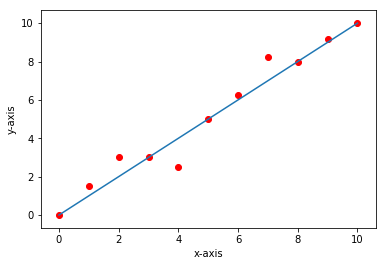

# Linear Regression using Scikit Learn

First Image Local reference from image folder

Second Image from html Image tag reference

Third Image markdown from the same folder

Fourth Image from Internet  using git link

Fifth Image from assets folder

